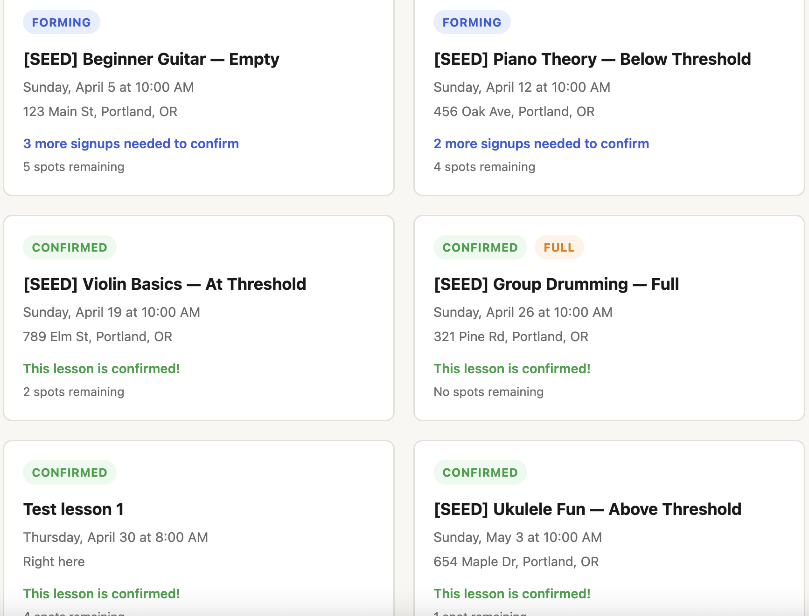

# Music Lesson Scheduler

A web application for scheduling group music lessons. The teacher posts available lesson slots; clients sign up; a lesson is confirmed once a minimum number of students have signed up.

## Features

- Teacher and superuser dashboards for managing lessons
- Clients sign up without creating an account — just a name, student name, and email
- Lessons confirm automatically when the minimum signup threshold is met
- Lessons auto-close if the threshold isn't met by the deadline
- Magic-link cancellations via email (no account required)
- Confirmation and reminder emails with calendar (.ics) attachments
- Mobile-friendly client-facing booking pages



## Running locally

### Prerequisites

- Python 3.9 or later

### First-time setup

```bash
cd music_scheduler
python3 -m venv venv
venv/bin/pip install -r requirements.txt
cp .env.example .env
```

Edit `.env` and fill in your email (SMTP) credentials and a secret key. See `.env.example` for the required fields. Gmail works well — use an [App Password](https://myaccount.google.com/apppasswords) rather than your regular account password.

### Running the server

```bash
venv/bin/python run.py
```

To start with sample lessons pre-loaded for testing:

```bash
venv/bin/python run.py --seed-initial-test-data
```

This creates 5 lessons at 2/9/16/23/30 days out, covering empty, below-threshold, at-threshold, full, and above-threshold states. No emails are sent. Re-running the flag clears and recreates the sample data. You can also run the seed script on its own without starting the server:

```bash
venv/bin/python seed_dev_data.py
```

The app runs at [http://127.0.0.1:5001](http://127.0.0.1:5001).

- **Client booking page:** http://127.0.0.1:5001/
- **Teacher/admin login:** http://127.0.0.1:5001/login

> **Note:** Port 5000 is used by AirPlay Receiver on macOS. The app runs on 5001 to avoid the conflict. You can disable AirPlay Receiver under System Settings → General → AirDrop & Handoff if you prefer port 5000.

### First login

A superuser account is created automatically on first run using the `SUPERUSER_EMAIL` and `SUPERUSER_PASSWORD` values from your `.env` file.

**Before starting the app for the first time**, set these to real values in `.env`:

```
SUPERUSER_EMAIL=your-real-email@example.com
SUPERUSER_PASSWORD=a-strong-password
```

The default email (`admin@example.com`) is intentionally fake — the app will not work for login until you replace it. The default password (`changeme123`) is intentionally weak — do not use it in production.

Once logged in, you can create teacher accounts and configure global settings from the admin dashboard.

### All-in-one timezone

The app assumes all users (teacher and clients) are in the same timezone. Times are stored and displayed in **Eastern Time (America/New_York)**, with DST handled automatically.

## Project structure

```
music_scheduler/
├── app/
│   ├── __init__.py          # App factory, DB init, superuser seeding
│   ├── config.py            # Dev/prod configuration
│   ├── models.py            # SQLAlchemy models (User, LessonSlot, Booking, GlobalSettings)
│   ├── utils.py             # Shared utilities (eastern_now)
│   ├── routes/
│   │   ├── auth.py          # Login / logout
│   │   ├── public.py        # Client-facing booking pages
│   │   ├── teacher.py       # Teacher dashboard
│   │   └── superuser.py     # Superuser admin
│   ├── services/
│   │   ├── scheduling.py    # Slot status transitions, auto-close, reminders
│   │   ├── notifications.py # Email sending (async background threads)
│   │   ├── calendar.py      # .ics file generation
│   │   └── jobs.py          # APScheduler hourly background job
│   ├── templates/           # Jinja2 HTML templates
│   └── static/              # CSS and JS
├── instance/                # SQLite database (created automatically, not committed)
├── run.py                   # Entry point (supports --seed-initial-test-data flag)
├── seed_dev_data.py         # Standalone seed script for local testing
├── requirements.txt
├── .env.example
└── .gitignore
```

## Notes

- The database (`instance/scheduler.db`) is created automatically on first run. It is not committed to version control.
- Email credentials (`.env`) are not committed to version control.
- The background scheduler (APScheduler) runs inside the Flask process and checks hourly for slots to auto-close and reminder emails to send.
